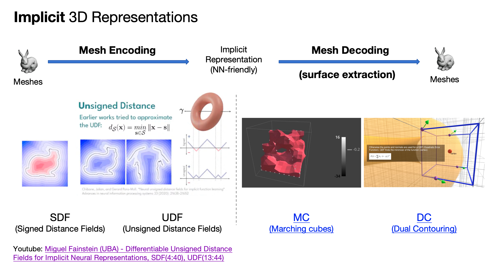
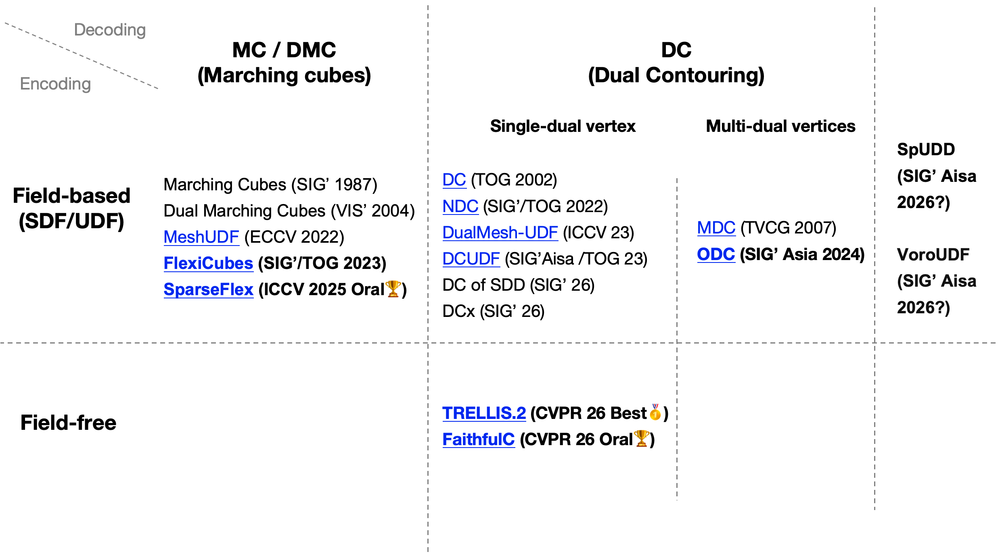

# Awesome Dual Contouring

Learn Dual Contouring. Build it. Go beyond it.

  

## Dual Contouring Related Research Map

  

This repo tracks Dual Contouring and nearby surface-extraction methods for SDF, UDF, occupancy fields, sparse voxel representations, and field-free mesh/dual-grid pipelines.

## Contents

- [Research & Academic Projects](#-research--academic-projects)
  - [Field-Based SDF and UDF](#field-based-sdf-and-udf)
    - [MC and DMC Marching Cubes Family](#mc-and-dmc-marching-cubes-family)
    - [DC Single-Dual-Vertex Methods](#dc-single-dual-vertex-methods)
    - [DC Multi-Dual-Vertex Methods](#dc-multi-dual-vertex-methods)
    - [UDC Representation for 3D Generation](#udc-representation-for-3d-generation)
    - [Beyond DC, Non-Voxel/Grid-based](#beyond-dc-non-voxelgrid-based)
  - [Field-Free DC-Like Structured Representations](#field-free-dc-like-structured-representations)
- [Contributing](#contributing)

## 🔬 Research & Academic Projects

### Field-Based SDF and UDF

#### MC and DMC Marching Cubes Family

1. [Marching Cubes: A High Resolution 3D Surface Construction Algorithm](https://doi.org/10.1145/37402.37422) - **SIGGRAPH 1987** | input = discrete SDF / scalar field | [YouTube tutorial](https://www.youtube.com/watch?v=M3iI2l0ltbE&t=143s)

2. [Dual Marching Cubes: Primal Contouring of Dual Grids](https://doi.org/10.1111/j.1467-8659.2005.00843.x) - **VIS 2004 / Computer Graphics Forum** | input = discrete SDF / scalar field on dual grids

3. [MeshUDF: Fast and Differentiable Meshing of Unsigned Distance Field Networks](https://arxiv.org/abs/2111.14549) - **ECCV 2022** | input = continuous neural UDF | [Code](https://github.com/cvlab-epfl/MeshUDF)
   

4. [Flexible Isosurface Extraction for Gradient-Based Mesh Optimization](https://arxiv.org/abs/2308.05371) - **SIGGRAPH / TOG 2023** | input = optimizable SDF / scalar field + FlexiCubes parameters | [Code](https://github.com/nv-tlabs/FlexiCubes)
   

5. [SparseFlex: High-Resolution and Arbitrary-Topology 3D Shape Modeling](https://arxiv.org/abs/2503.21732) - **ICCV 2025 Oral** | input = sparse voxelized SDF / scalar field + SparseFlex parameters | [Project](https://xianglonghe.github.io/TripoSF) | [Code](https://github.com/VAST-AI-Research/TripoSF)
   

#### DC Single-Dual-Vertex Methods

1. [Dual Contouring of Hermite Data](https://doi.org/10.1145/566570.566586) - **SIGGRAPH / TOG 2002** | input = Hermite data from SDF / scalar field | [YouTube tutorial](https://www.youtube.com/watch?v=B_5VBtpVuLQ)

2. [Neural Dual Contouring](https://arxiv.org/abs/2202.01999) - **SIGGRAPH / TOG 2022** | input = SDF / UDF / occupancy grid / point cloud | [Code](https://github.com/czq142857/NDC)
   

3. [Self-Supervised Dual Contouring](https://arxiv.org/abs/2405.18131) - **arXiv 2024** | input = SDF / neural implicit SDF | [Code](https://github.com/Sentient07/SDC)
   

4. [Surface Extraction from Neural Unsigned Distance Fields](https://arxiv.org/abs/2309.08878) - **ICCV 2023** | input = continuous neural UDF | [Code](https://github.com/cong-yi/DualMesh-UDF)
   

5. [Robust Zero Level-Set Extraction from Unsigned Distance Fields Based on Double Covering](https://arxiv.org/abs/2310.03431) - **SIGGRAPH Asia / TOG 2023** | input = continuous UDF | [Code](https://github.com/jjjkkyz/DCUDF)
   

6. [Dual Contouring of Signed Distance Data](https://arxiv.org/abs/2604.00157) - **SIGGRAPH 2026** | input = discrete SDF

7. [Dual Contouring over Expanded Cubes (DCx) for Zero-Level Set Extraction from Neural Unsigned Distance Functions](https://s2026.conference-schedule.org/presentation/?id=papers_1461&sess=sess146) - **SIGGRAPH 2026** | input = continuous neural UDF | [Code](https://github.com/jjjkkyz/DCx)
   

#### DC Multi-Dual-Vertex Methods

1. [Manifold Dual Contouring](https://doi.org/10.1109/TVCG.2007.1012) - **TVCG 2007** | input = SDF / implicit field + Hermite data

2. [Occupancy-Based Dual Contouring](https://arxiv.org/abs/2409.13418) - **SIGGRAPH Asia 2024** | input = continuous occupancy field | [Code](https://github.com/KAIST-Visual-AI-Group/ODC)
   

#### UDC Representation for 3D Generation

1. [GenUDC: High Quality 3D Mesh Generation with Unsigned Dual Contouring Representation](https://arxiv.org/abs/2410.17802) - **ACMMM 2024** | input = discrete UDC grid representation | [Code](https://github.com/TrepangCat/GenUDC)
   

#### Beyond DC, Non-Voxel/Grid-based

1. [SpUDD: Superpower Contouring of Unsigned Distance Data](https://arxiv.org/abs/2604.19568) - **arXiv 2026** | input = discrete UDF

2. [VoroUDF: Meshing Unsigned Distance Fields with Voronoi Optimization](https://arxiv.org/abs/2602.02907) - **arXiv 2026** | input = continuous UDF

### Field-Free DC-Like Structured Representations

1. [TRELLIS.2: Native and Compact Structured Latents for 3D Generation](https://microsoft.github.io/TRELLIS.2/) - **CVPR 2026 Oral** | input = field-free mesh surface x voxel / dual-grid intersections | [Paper](https://arxiv.org/abs/2512.14692) | [Code](https://github.com/microsoft/TRELLIS)
   

2. [Faithful Contouring: Near-Lossless 3D Voxel Representation Free from Iso-surface](https://arxiv.org/abs/2511.04029) - **CVPR 2026 Oral** | input = field-free sparse voxel mesh representation | [Code](https://github.com/Luo-Yihao/FaithC)
   

## Contributing

Pull requests are welcome. Good entries should include:

- paper / project link
- venue and year
- code link, if official code exists
- input type, such as `continuous UDF`, `discrete UDF`, `SDF`, `occupancy field`, `point cloud`, or `field-free mesh/dual-grid`

Please prefer official project pages, arXiv / DOI pages, conference pages, and official code repositories.
